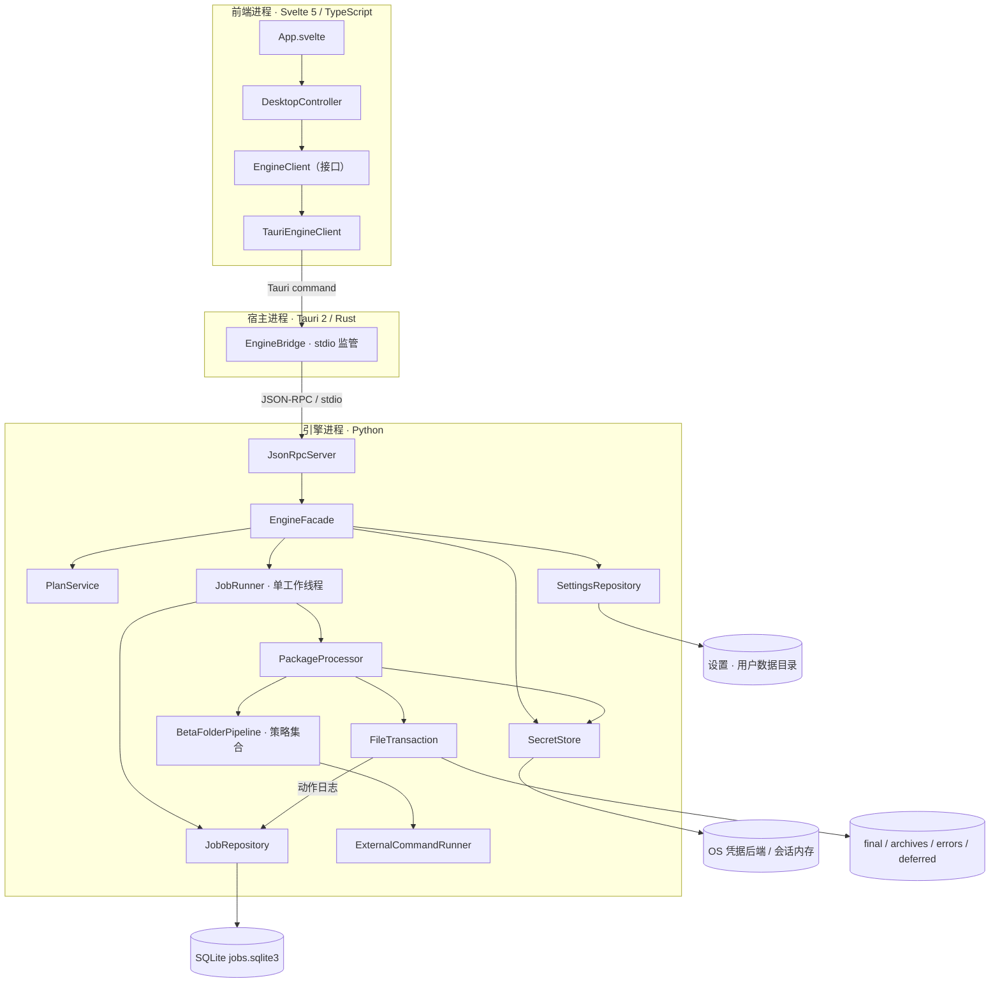
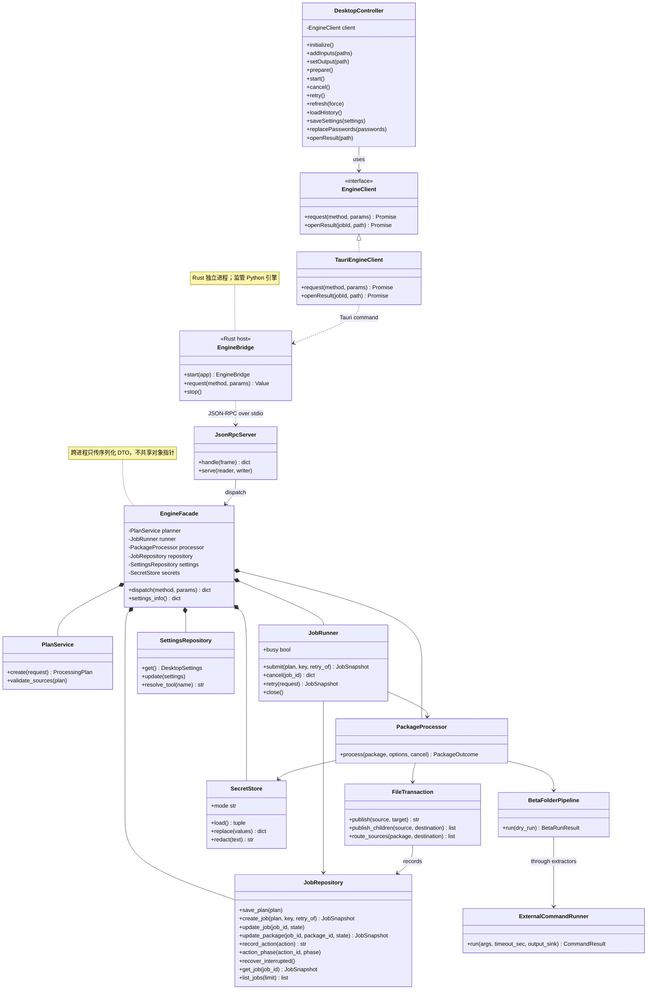
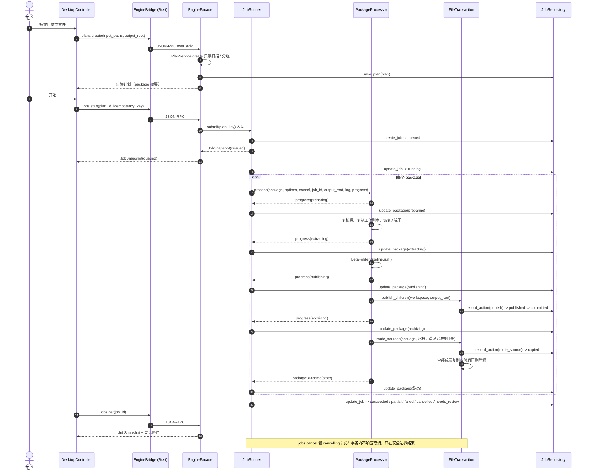
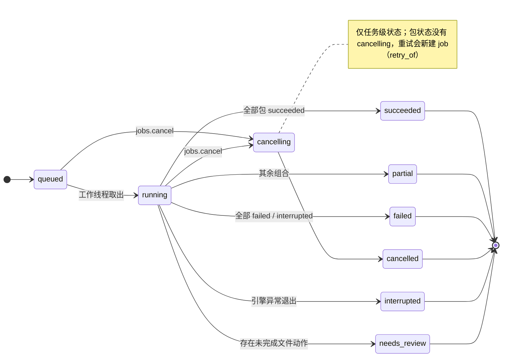
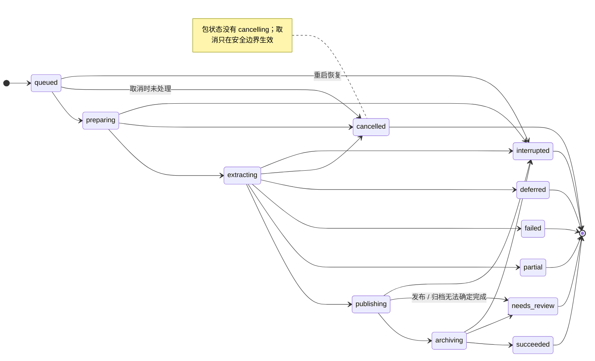

# 桌面首版工程设计与实施契约

日期：2026-10-07。产品依据：[产品方案](product_plan.md)。
状态：设计已确定，用户已授权依此实施；实现、验证、人工验收分别记录在 [实施状态](desktop-status.md)。

## 1. 首版验收范围

跨平台桌面架构，Windows x64 首交付。保留 CLI；桌面提供目录/文件拖放、只读计划、单队列执行、取消、错误重试、最近任务、密码与工具设置、结果打开。
不在首版加入浏览器服务器、目录监听、托盘自动处理、云服务或 Agent。

安全默认：不原地修改输入。需要变换的文件进入独立工作区。成品发布后再归档原件；归档不完整不报告成功。用户无需掌握工具命令或候选后缀。

## 2. 依赖方向与对象职责

| 对象 | 接口与责任 | 所拥有的资源 / 生命周期 |
|---|---|---|
| DesktopController | initialize/prepare/start/cancel/retry/loadHistory/saveSettings；把业务快照转成界面状态 | 当前计划、任务、轮询订阅；关闭时释放 |
| EngineClient | request(method, params)；唯一前端引擎接口 | IPC 请求；所有 UI 都依赖这个接口 |
| TauriEngineClient | 使用受限的 Tauri command 实现 EngineClient | 不操作文件、不持有密码 |
| EngineBridge（Rust） | 启动引擎、请求匹配、读取响应、引擎退出、结果打开 | 子进程、管道、待响应请求；应用级对象 |
| JsonRpcServer（Python） | 验证协议、路由白名单、序列化响应 | stdin/stdout；控制读取独立于任务线程 |
| EngineFacade | 系统信息、计划、任务、配置、结果的稳定入口 | 组合其他对象；不实现解压规则 |
| PlanService | 只读输入扫描、分组、源快照、冲突与路径检查 | 计划 DTO；不能移动文件或自动下载工具 |
| JobRunner | 单执行队列、取消、重试、终态与中断恢复 | 一个执行线程、每任务取消信号；引擎级对象 |
| PackageProcessor | 准备工作区、调用现有管线、检查输出、生成包结果 | 一个包的工作区和 Runner |
| FileTransaction | 写入动作记录，发布输出，再路由真实原件 | 文件句柄、动作状态；包级对象 |
| JobRepository | SQLite 数据版本、任务/包/事件/动作持久化与分页 | 一个受锁保护的连接；唯一数据库写入口 |
| SettingsRepository | 读取/验证普通配置，工具路径与能力 | 用户数据目录；与项目样例 config 分离 |
| SecretStore | 保存、读取、替换密码集；不返回明文到 UI | 系统凭据后端；不可用时仅会话内存 |
| ExternalCommandRunner | 有界日志、时间期限、取消、进程树控制 | 每次工具调用的子进程和输出读取线程 |

组合优先；已有 RestorerStrategy、ExtractorStrategy、VolumeGroupingStrategy 保持不变。
DTO 使用明确的输入/输出模型；只有持有状态和生命周期的部分设计成对象，不为了面向对象增加万能基类。

## 3. 类图

下图 `*--` 为组合、`-->` 为调用依赖、`..>` 为跨进程适配、`<|..` 为接口实现；Rust 与 Python 分属不同进程。

Rust 的 EngineBridge 与 Python 的 EngineFacade 属于不同进程，不是互相继承的类。
跨进程只能传序列化 DTO，不能共享 Python 对象指针或 Rust 引用。

## 4. 数据模型与不变量

### ProcessingPlan

- plan_id、created_at、options、output_root、packages。
- 每个 package：package_id、entry、members、group_key。
- 每个源成员：absolute_path、size、mtime_ns；拒绝符号链接/非普通文件。
- input_paths 由明确的系统对话框或拖放输入；选文件只处理所选文件组成的完整组，不处理旁边未选文件。
- 输出不能覆盖软件安装目录或工作区，不接受空/相对/越界路径。
- 开始前重验源快照；计划改变必须重新扫描。
- 源路径不是恢复副本路径；包 ID 在所有阶段稳定。

### JobSnapshot / PackageOutcome

- job_id、state、created_at、updated_at、counts、packages、last_seq。
- 包状态区分 succeeded、partial、failed、deferred、cancelled、interrupted、needs_review。
- results 保存已登记成品、原件归档与错误位置。
- 不存储密码明文；错误和日志脱敏。
- 一个源文件同一时间只能属于一个活跃执行任务。

### OperationRecord

- action_id、job_id、package_id、kind、source、destination、phase、source_size、source_mtime_ns。
- phase：prepared → copied/published → source_removed → committed。
- 记录意图再执行文件操作；不能把 SQLite commit 等同于文件系统事务。
- 中断后检查真实路径与身份，禁止盲目删除原件或全任务自动重跑。

## 5. 通信契约

JSON-RPC 2.0 over UTF-8 JSON Lines；protocol_version=1。
stdout 只写完整协议帧，stderr 只写诊断；最大帧 1 MiB。
UI 不启动任意程序，不传任意 shell 命令。Rust 与 Python 各维护明确业务白名单。

| 方法 | 输入 | 输出 / 幂等 |
|---|---|---|
| system.info | 无 | 引擎版本、协议、平台、工具与能力 |
| plans.create | input_paths、output_root、options | ProcessingPlan；只读 |
| jobs.start | plan_id、idempotency_key | JobSnapshot；同 key 返回同任务 |
| jobs.get / jobs.list | job_id / limit | 快照 / 最近任务 |
| jobs.cancel | job_id | 是否已接受取消；终态通过快照获得 |
| jobs.retry | job_id、package_ids、idempotency_key | 新任务；只重做明确失败/中断包 |
| jobs.events | job_id、after_seq、limit | 有界事件页 |
| jobs.logs | job_id、cursor、limit | 脱敏日志页 |
| settings.get / settings.update | 受限选项 | 设置快照、工具状态、密码数量 |
| passwords.replace | 用户主动提供的密码列表 | 数量、存储模式；不返回明文 |
| results.get | job_id | 注册的输出路径 |

设置包括 7z/可选工具路径、深度上限、识别阈值、保留 payload 名称、最大输出空间、工具超时、工作区保留。
首版 UI 使用适度快照轮询；控制接口和引擎任务线程独立，取消可及时读取。可在同契约上增加推送，不能让 UI 解析日志判断状态。

错误分两层：协议错误（非法 JSON、方法不存在、参数错误）、业务错误（INPUT_CHANGED、BUSY、DISK_FULL、UNSAFE_ARCHIVE、TOOL_TIMEOUT、ARCHIVE_ROUTE_FAILED 等）。取消是独立终态，不伪装成密码错误。

## 6. 一次处理的时序

重试为新的 job_id，保留与旧任务的关联；旧成功包不重做。
取消在发布事务的安全边界检查，不能中断一半的源文件删除后直接报告 cancelled。

## 7. 状态与异常流程

任务级与包级是两套独立状态机：`JobSnapshot.state` 含 `cancelling`，`PackageSnapshot.state` 不含 `cancelling`。

**任务（JobSnapshot.state）**

**包（PackageSnapshot.state）**

不同错误的最终位置：

| 结果 | 输出 | 原件 |
|---|---|---|
| 完全成功 | final | success/archives |
| 有部分输出 | error_files/分类 | success/archives |
| 完全失败 | 错误说明 | error_files/分类 |
| 缺卷 | deferred 结果 | deferred_volumes/组 |
| 取消 | 保留/清理本包工作区，不发布假成功 | 原位置保持 |
| 归档异常 | 已生成的成品登记保留 | 剩余原件保留并标记 needs_review |

动作日志协调恢复；没有真实 7z 流内续传承诺。

## 8. 进程与安全边界

- 宿主监管引擎，Runner 监管工具；Windows 使用进程树终止实现，Unix 使用进程组。
- 工具输出通过后台读取与有界队列传递；独立期限检查，解决当前 stdout 阻塞导致 timeout 不生效的问题。
- 只保留有界日志尾部，完整日志滚动写盘；禁止无限 collected。
- 归档成员预检、输出检查、拒绝越界路径/危险链接、空间和层数限制。
- 引擎的路径校验不依赖前端：即使直接构造 IPC 请求也必须约束操作。
- 不执行解出的文件，默认无网络服务。
- 系统凭据后端不可用时不回退明文落盘，显示会话密码模式。
- 工作目录和 Rust 的内存安全不代表操作系统沙箱；第三方解压器仍需版本维护。

## 9. 实施分工与验证边界

本会话委派链路存在任务正文丢失；主线程实施，所有模块保持明确文件所有权，后续兼容会话可独立委派。

| 切片 | 文件范围 | 最小验收 |
|---|---|---|
| 引擎数据与计划 | application/models、planning | 参数验证、选文件范围、分组、输入变化 |
| 任务与文件事务 | application/jobs、processing；infrastructure/job_repository、file_transaction | 成功/部分/失败/取消/中断、原件字节与路径 |
| 进程/安全/秘密 | command_runner、archive_safety、secret_store | 有界日志、超时、取消、恶意路径、密码不落盘 |
| 桌面桥接 | apps/desktop/src-tauri | Rust 编译、坏协议、进程退出、命令白名单 |
| 界面 | apps/desktop/src | 类型/构建、Controller 状态切换、简单操作 |
| 发布与指导 | scripts、docs | Windows 打包 smoke、产物资源与文档链接 |

数据完整性和取消跨越多个模块，因此必须做定向集成验证；真实特殊格式和主观界面体验由用户验收。
所有“通过”必须对应命令、退出状态和最终文件状态，不能只写“无 bug”。

## 10. 学习文档组织

- 本文：先看依赖图、对象职责、类图，再看时序与状态。
- docs/desktop-code-guide.md：按一个按钮追踪到源文件，解释对象组合和错误处理。
- docs/desktop-language-guide.md：TypeScript/Svelte/Rust 与 Python/Java/C++ 的对照；聚焦本项目用到的语法。
- docs/desktop-user-guide.md：下载、运行、设置、结果和人工验收操作。
- docs/desktop-status.md：实际完成范围、检查证据、未验证能力与待办。
- docs/diagrams/：可维护图源（architecture.json、modules.mmd、classes.mmd、sequence.mmd、states.mmd、package_states.mmd），SVG 就地生成。
- artifacts/diagrams/continuation/：PNG 预览与 render 报告（git 忽略）。
- 重现命令：`rtk proxy /usr/local/bin/python scripts/render_desktop_diagrams.py`（`--list` 列出全部图，`--only <name>` 只渲染一张）。
