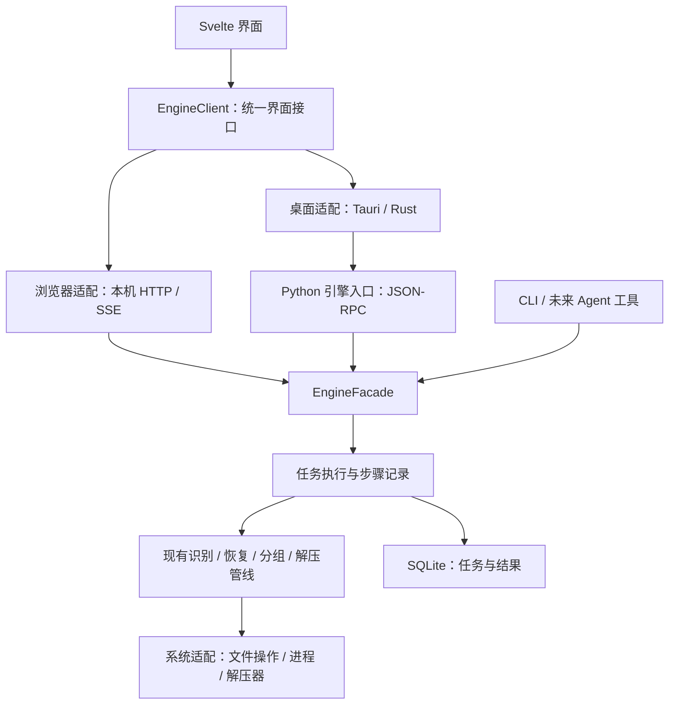

# 星绫解封 · Hoshiribbon：跨平台软件产品方案

更新：2026-10-10。状态：方案已批准；用户已确认当前修复并授权发布 **0.3.1 Windows x64 便携预发布**；0.3.0 历史发布保留。本文保存产品目标和选型；实际交付、检查与人工验收状态见 [desktop-status.md](desktop-status.md)。

## 1. 更新后的目标与约束

将现有自动解压管线做成一个开源、跨平台、小而美的桌面软件。第一交付平台是 Windows；从首版开始保持界面、业务接口和核心逻辑可复用，后续交付 macOS、Linux。

本阶段按已批准方案实施手动桌面版、Windows 产物、面向对象图与制作方阅读指南；真实文件和操作体验由用户人工验收。

已确认：

- 独立桌面应用，可以使用内置 WebView；提供 EXE 入口、拖放、系统文件对话框。
- 首版做手动批处理，业务范围沿用当前脚本；操作简单，复杂参数收进高级设置。
- 浏览器控制版也给出方案，与桌面版共享业务接口和界面。
- 目录监听、托盘自动处理、接入现有 Agent 与大模型 API 都是后续愿景，按实际需求实施。
- 制作方熟悉 Python、Java、面向对象和 C++ 指针；说明应解释新技术的用途、代码结构和运行关系。
- 性能结论需要代码证据和测量；不能把更换语言等同于性能提升。
- 方案阶段的“仅写方案”限制已由后续实施授权解除；当前允许实施、构建，并按目标分阶段提交和推送。浏览器、监听与 Agent 仍留后续。

内置目标卡当前只能修改状态，不能原地修改目标描述。后续执行以本节记录的完整目标及用户追加要求为准。

## 2. 当前基础与差距

已检查当前代码和发布脚本：

| 基础 | 证据与现状 |
|---|---|
| 核心业务 | services 中已有分卷分组、后缀规范化、密码轮询、Apate、restoreAB、嵌入归档、多层解压和结果分流 |
| 生命周期 | BetaFolderPipeline 记录实际原件集合，成功进入 success/archives，成品进入 final；部分输出进入 error_files；缺卷进入 deferred_volumes |
| CLI | beta.py、portable.py 提供目录、工具、配置和日志入口 |
| 外部解压 | Python 调用 7-Zip、RAR/UnRAR、Bandizip；主要解压运算在这些原生程序中完成 |
| Windows 交付 | scripts/build_windows_dist.ps1 已用 PyInstaller --onedir 打包 Python 和依赖 |
| 仍缺少 | 桌面 UI、稳定的任务接口、可取消的任务、持久任务状态、明确的恢复流程、跨平台工具适配 |
| 文档差异 | 旧 README、ARCHITECTURE 中有历史目录名称；产品实施时应统一为实际管线行为 |

不能把现有终端日志当作稳定 API，也不能直接把 beta.main() 放进界面线程。旧 CLI 可继续保留，桌面端需要通过受控的业务入口调用引擎。

## 3. 选定技术栈

### 3.1 主方案

**Tauri 2 + Svelte 5 + TypeScript + Vite；Rust 做桌面宿主，Python 做业务引擎；SQLite 保存任务。**

| 部分 | 选择 | 职责 |
|---|---|---|
| 界面 | Svelte 5、TypeScript、CSS | 文件队列、状态、设置、结果；同一份界面供桌面和浏览器使用 |
| 前端构建 | Vite、npm | 开发预览、编译静态资源、依赖锁定；实际使用 package-lock.json |
| 桌面宿主 | Tauri 2、Rust | 窗口、对话框、拖放、单实例、启动和监管引擎、受控系统操作 |
| 业务引擎 | 现有 Python 包 | 保留并重整识别、恢复、工具选择、密码尝试、多层解压和文件分流 |
| 协议模型 | Pydantic 2 + TypeScript DTO | Python 严格验证输入；首版手工维护同名 DTO，尚未实现 Schema 自动生成；现有内部 dataclass 保留 |
| 持久数据 | Python sqlite3 | 任务状态、步骤记录、结果索引、版本迁移；引擎是唯一写入者 |
| 外部解压器 | 7-Zip 为默认，其他为可选适配器 | 按格式及已验证兼容性执行解压 |
| 浏览器适配 | FastAPI + Uvicorn，后续阶段 | 在本机提供 HTTP 接口和事件流；桌面版首版不需要 HTTP 服务 |
| Python 分发 | PyInstaller onedir | 沿用当前基础，用户无需安装 Python |

具体版本锁定到 package-lock.json、Cargo.lock 和 Python 构建依赖清单；生产发布使用锁定版本，不追随每次上游更新。

Svelte 通过编译生成界面代码，适合此类页面少、状态明确的工具。采用普通 Vite SPA，首版无需 SvelteKit 的服务端渲染、Node 服务器或复杂路由。参见 [Svelte 概述](https://svelte.dev/docs/svelte/overview) 和 [TypeScript 支持](https://svelte.dev/docs/svelte/typescript)。

Tauri 支持捆绑独立引擎程序，也明确覆盖 PyInstaller 打包的 Python 程序。参见 [官方 sidecar 文档](https://v2.tauri.app/develop/sidecar/)。

### 3.2 候选方案与取舍

| 方案 | 优势 | 本项目取舍 |
|---|---|---|
| Tauri + Svelte | 现代前端、系统集成、桌面与浏览器复用 | 主方案；接受 WebView 运行时及不同平台渲染差异 |
| Tauri + React / Vue | 可用生态丰富，也能完成需求 | 备选；当前工具规模适合较直接的 Svelte 组件和状态 |
| Electron | 桌面 Web 技术生态成熟、浏览器运行时一致 | 不作为首选；自带浏览器及 Node，需额外承担分发和运行时成本，具体内存差异仍需实测 |
| Flutter | 本地编译的跨平台桌面界面，也支持 Web | 不采用；需要增加 Dart 与平台插件维护，用户已接受 WebView，收益不足以改变主方案 |
| Slint | Rust 等语言可用的跨平台界面 | 不采用；适合以后严格要求非 WebView 的产品，需要另核查控件、可访问性与许可证 |
| WinUI 3 | Windows 原生控件与 Windows App SDK 集成 | 不符合复用同一桌面界面到 macOS/Linux 的首要目标 |
| PySide6 / Qt | 制作方可主要用 Python，桌面功能成熟 | 可行备选；浏览器版的 UI 复用较弱，也需要单独规划 Qt 分发许可 |

平台事实见 [Flutter 桌面支持](https://docs.flutter.dev/platform-integration/desktop)、[Slint](https://slint.dev/get-started) 和 [微软 WinUI 文档](https://learn.microsoft.com/en-us/windows/apps/winui)。上表中的项目适配判断是本方案的工程取舍，不是性能实测排名。

## 4. 后端语言：保留 Python，按证据引入 Rust

首版不全面改写为 C++、Rust 或 Java。先把 Python 从脚本式入口整理为可调用、可观测、可取消的引擎。

原因：

1. 核心解压已经由外部原生程序执行。把编排从 Python 改成 Rust，并不会自动提高 7-Zip 的解压速度。
2. 对大文件，扫描次数、复制次数、磁盘竞争、密码尝试和日志增长往往比语言本身更值得先处理。
3. 现有特殊格式规则和回滚逻辑是项目资产。全面重写需要证明行为等价，并会增加真实文件回归成本。
4. Python 有利于制作方继续维护业务、调试格式规则和接入 Agent。

**新增长期性能模块优先选 Rust。** 如果测量证明纯 Python 的扫描/解析占主要时间，再把有明确输入输出的部分移到 Rust，可通过独立可执行程序或 PyO3 模块连接。第一阶段不增加 FFI。

| 语言 | 本项目定位 |
|---|---|
| Python | 首版业务编排、规则、任务状态与 CLI；先优化算法和 I/O |
| Rust | 桌面宿主；后续实测热点的优先迁移语言，编译器帮助约束内存和并发使用 |
| C++ | 继续使用成熟解压器；不自行重造压缩算法或引入大范围指针与生命周期维护 |
| Java | 制作方熟悉且有成熟并发库，但新增 JVM、桌面桥接和重写成本，目前没有足够收益 |

Rust 的内存安全不会代替路径校验、权限控制、密码保护或外部解压器更新。最终可用稳定协议替换整个 Python 引擎，但仅在资源目标、维护成本或实测收益要求这样做时重新决策。

## 5. 两种交付形态

### A. 跨平台桌面版：主产品

安装或解压后启动归序，界面使用本地静态资源。后台引擎随软件一起发布，不打开浏览器，不要求用户启动服务器。

- 选目录、拖文件/目录、系统文件对话框。
- 进度与结果集中在同一窗口。
- 受控地打开工作文件夹、查看日志（0.3.1 起公开密码不掩码，见第 18 节）。
- 首版关闭窗口时，如仍有任务，明确选择继续等待或取消；暂不默认隐藏到托盘。
- 引擎只在有任务或查询需要时启动；空闲释放，降低常驻资源。

Windows 用 WebView2，macOS 用系统 WKWebView，Linux 用 WebKitGTK。它是独立桌面软件，界面渲染采用系统 WebView。参见 [Tauri WebView 说明](https://v2.tauri.app/reference/webview-versions/)。

### B. 本机浏览器控制版：后续适配

运行归序的本地服务，在本机浏览器打开界面；使用同一 Svelte UI 和业务 DTO。

- 只监听 127.0.0.1；首版浏览器适配不开放局域网和公网。
- 处理服务所在机器的文件；不把大压缩包上传到云。
- 浏览器拖放/选文件不能提供普通本机绝对路径给后端。使用启动时授权的目录列表及受限目录选择接口，不假装浏览器具有桌面文件系统权限。
- CLI、自动化和 Agent 可以复用同一任务契约。
- 独立安装包的入口负责启动服务、打开页面和关闭服务。

| 对比 | 桌面版 | 浏览器版 |
|---|---|---|
| UI | 同一套组件 | 同一套组件 |
| 输入选择 | 原生对话框与拖放 | 已授权根目录内选择 |
| 通信 | Tauri IPC + stdio | HTTP + SSE |
| 常驻服务 | 无需 HTTP 服务 | 本机进程 |
| 产品优先级 | 首版 | 后续按需求 |

## 6. 首版交互与功能边界

主流程：**添加 → 开始处理 → 查看结果。**

添加时自动做只读扫描，展示一行摘要：“发现多少组、哪些缺卷、原件归档位置、结果位置”。不强迫用户逐个配置工具、候选后缀或密码轮询。

界面组织：

- 主区域：选择目录/拖放区、输入与输出位置、开始按钮。
- 队列：包名称、状态、当前步骤、可用进度、失败原因。
- 完成区：打开成品、打开原包归档、重试失败项。
- 设置抽屉：密码库、工具状态；高级区放展平、深度、阈值、工具选择和路径规则。
- 日志默认折叠；常规用户看到可操作的原因，而不是完整命令行。

首版功能：

| 功能 | 复用或新增 |
|---|---|
| 目录批处理、单文件/分卷 | 复用业务；文件拖放适配为明确的包选择，不能意外处理同目录其他文件 |
| 自动识别、恢复、改名、多层解压 | 复用策略，整理调用入口 |
| 密码库与多个解压器 | 复用能力，提供公开明文密码编辑与工具配置 |
| final、success/archives、error_files、deferred_volumes 分流 | 复用语义，补齐可观察的最终状态 |
| 预览与开始 | 只读计划与实际执行分离；计划不是预先保证解压成功 |
| 取消、失败重试、最近任务 | 软件交互必需的薄管理层；首版不提供解压过程任意位置续传 |
| 工具自检与结果打开 | 把已有诊断变成可理解的状态 |

目录展平属于改变文件布局的选项。GUI 默认关闭，显示其效果后由用户开启；旧 CLI 保持现有兼容行为。智能识别、深度处理和密码轮询使用合理默认值，高级参数不成为必填步骤。

## 7. 模块与运行关系



模块契约：

| 模块 | 对外责任 | 状态与资源 |
|---|---|---|
| EngineClient | UI 调用计划、任务、设置、结果 | 界面缓存与事件订阅；不决定文件怎么改 |
| Rust 桌面宿主 | 系统交互、受控桥接、引擎生命周期 | 窗口、引擎句柄；不复制恢复/密码/分卷规则 |
| EngineFacade | 小而稳定的业务入口，验证用户输入与授权 | 引擎会话、任务入口；供所有适配器使用 |
| JobRunner | 执行计划、响应取消、记录状态、恢复中断 | 首版单执行队列；外部工具仍可内部多线程 |
| FileTransaction | 准备、发布成品、归档原件、处理冲突 | 文件身份、动作日志、工作区；集中生命周期保证 |
| PlatformAdapters | 进程树控制、路径、工具探测、凭据 | Windows/macOS/Linux 的独立实现 |
| JobRepository | 保存任务与动作、分页查询 | SQLite 唯一写入路径；UI/Rust 不直接写数据库 |

不拆成微服务，不建立远程数据库，不让每种前端重新实现流水线。接口外隐藏工具选择、候选重试和目录分流的复杂性。

建议目录演进：

```text
apps/desktop/              Svelte + Tauri 宿主
packages/engine-client/     UI 的协议模型和两种通信适配
src/reorder_engine/         现有核心与 CLI
  application/             EngineFacade、JobRunner
  transport/               stdio；后续 HTTP
  infrastructure/          文件、进程、凭据、SQLite
docs/                      沿用当前方案和发布文档
scripts/                   按平台构建与发布
```

只在对应阶段建立实际需要的目录和文件，不一次铺完整空骨架。

## 8. 文件生命周期、取消与恢复

计划记录包 ID、所有源成员、配置版本、拟用工作目录和输出位置。计划创建不改名、不展平、不还原、不下载工具。

执行顺序：

1. 复核源文件身份、大小与修改时间，检查路径重叠、冲突、可写性和空间。
2. 锁住当前任务的输入/输出范围；同一组分卷只允许一个任务处理。
3. 按需准备工作副本；Apate 等原地变换在工作副本上进行。只读解压可直接读原包，减少整包复制。
4. 执行恢复与解压，输出先进入任务工作区；检查退出结果、输出路径和资源限制。
5. 发布成品，处理同名冲突；然后归档原件，最后落下任务完成状态。
6. 保留结果与操作记录；只清理本任务确认可删除的临时文件。

关键保证：

- 源路径、候选副本、实际改名路径是不同概念，必须分别记录；不能再用解压入口冒充原件。
- 多卷原件作为一组分流，任一成员处理不完整都需要明确显示。
- 原包移动失败时，即使成品已经生成，也不能报告完整成功；记录“成品已生成，归档待处理”。
- 部分解出与完全失败是不同结果；界面显示真实状态，不把现有 ok_count 直接解释为完全解压成功。
- 不自动删除用户源文件，也不自动执行解出的程序。
- 同盘 rename 可用于原子发布；跨盘移动要采用复制、验证、记录完成后再移除源路径，不能当作原子操作。
- SQLite 事务与文件系统操作不是同一个事务；通过动作日志和可重复确认的步骤协调，异常后检查真实源/目标状态。
- 缺卷进入等待分类；可完整补卷后重新建立任务。
- 取消先进入 cancelling，工具退出和必要的回滚结束后才能进入 cancelled。

包状态：

```text
planned → queued → preparing → extracting → publishing → archiving → succeeded
                                  ├→ partial
                                  ├→ failed
                                  ├→ deferred
                                  └→ cancelling → cancelled
崩溃或强制退出 → interrupted → 检查动作记录 → 重新处理包 / 完成归档 / needs_review
```

首版的“恢复”是按包重新处理或完成未结束的归档，不是从 7-Zip 的压缩流中间继续。加密包的后续重试可能需要重新提供密码。

## 9. 前后端协议

### 9.1 桌面通信

UI 的 EngineClient 调用受限 Tauri commands；Rust 启动 Python 引擎，通过 stdin/stdout 的 UTF-8 JSON Lines 通信。

- 使用 JSON-RPC 2.0 请求/响应；事件使用无 id 的通知。
- stdout 只传协议，诊断写 stderr，工具原始输出由 Runner 单独处理。
- 不在 IPC 中传压缩包字节，只传路径引用、包 ID、设置与事件。
- 一个协议帧上限建议 1 MiB，超限拒绝；长日志和大列表分页。
- 启动握手返回 protocol_version、engine_version、capabilities。
- 控制读取与耗时任务分开执行；取消请求不能等当前解压结束才被读取。
- 同一写入锁串行输出协议帧，避免并发日志/事件打乱 JSON。
- UI 只能调用白名单业务命令；不给任意 shell、任意程序启动或全盘文件操作权限。

示例：

```json
{"jsonrpc":"2.0","id":"req-1","method":"jobs.start","params":{"plan_id":"plan-1","idempotency_key":"start-1"}}
{"jsonrpc":"2.0","id":"req-1","result":{"job_id":"job-1","state":"queued"}}
{"jsonrpc":"2.0","method":"job.event","params":{"job_id":"job-1","seq":17,"type":"package.state","package_id":"pkg-1","state":"extracting","progress":null}}
```

progress 为 null 表示当前工具不能可靠提供百分比。展示步骤和已完成包数，避免伪造进度。状态事件可以按 seq 补取，界面断开后用快照加后续事件恢复。

### 9.2 业务接口

| 方法 | 核心输入 | 输出与约束 |
|---|---|---|
| system.info | 无 | 版本、平台、能力、工具状态 |
| plans.create | 授权输入引用、输出根、配置 ID | plan_id、包摘要、拟执行动作、缺卷和冲突 |
| plans.get | plan_id、分页 | 计划明细；过期或输入改变需要重新计划 |
| jobs.start | plan_id、幂等键 | job_id；重复请求返回同一次创建的任务 |
| jobs.get / jobs.list | job_id 或分页过滤 | 快照、包计数、结果分类 |
| jobs.cancel | job_id | 已接受取消；终态从事件或查询获得 |
| jobs.retry | 原 job_id、明确失败包 ID、配置引用 | 新任务；不重做成功包或隐式扩大范围 |
| jobs.events | job_id、after_seq | 有界事件页与最新快照 |
| jobs.logs | job_id、cursor、limit | 日志页；公开密码不掩码（见第 18 节） |
| settings.get / settings.update | 允许修改的字段 | 配置版本；不回传密码明文 |
| passwords.import | 用户选择的本地文件/秘密输入 | 密码集 ID 与数量；不出现在普通任务数据中 |
| results.get | job_id、包 ID | 成品、归档、错误及待处理位置 |
| paths.open_result | 结果 ID | 桌面宿主打开已登记位置；不接受任意执行命令 |

计划指纹、路径授权和输入复核由引擎负责，界面校验只帮助用户发现输入错误。内部错误使用稳定 code，例如 INPUT_CHANGED、MISSING_VOLUME、PASSWORD_EXHAUSTED、TOOL_TIMEOUT、DISK_FULL、ARCHIVE_ROUTE_FAILED；返回可理解消息及是否可重试。

### 9.3 浏览器映射

HTTP 使用 /api/v1，典型路由为 POST /plans、POST /jobs、GET /jobs/{id}、POST /jobs/{id}/cancel、GET /jobs/{id}/events。共享同一 EngineFacade 和数据模型，维护 OpenAPI。

认证和本机访问：

- 启动时产生随机会话 token，经打开页面的 URL fragment 一次传给界面；立即移除 fragment，不写日志或持久存储。
- 所有 API 与 SSE 的 fetch 请求都使用 Authorization header；不把 token 放查询字符串。
- UI 静态资源与 API 同源；校验 Host、Origin，禁止任意 CORS，拒绝非授权根目录和越界路径。
- SSE 用 fetch 流读取，避免原生 EventSource 无法设置自定义认证 header 的问题。
- 服务退出后 token 失效；限制输入长度、请求速率与事件缓存。

同机恶意进程和拥有同一用户权限的攻击者不属于该 token 可完全隔离的范围；本机接口仍需正常的路径和命令约束。

## 10. 性能审视与优化顺序

以下是代码静态证据，尚未进行产品性能基准测试。

| 位置 | 当前现象 | 优先处理 |
|---|---|---|
| infrastructure/command_runner.py:94–124 | 流式输出全部追加 collected，再拼成完整字符串；非流式 capture_output 同样全量保存 | 日志流写文件，内存只保留有界尾部；UI 分页、限长 |
| command_runner.py:96–117 | 同步读 stdout，结束后才 wait(timeout)；没有输出且进程挂住时期限不一定生效 | 独立截止时间与取消信号；监管进程树，不只等读循环结束 |
| restore_ab.py:231–264 | can_handle 与 restore_with_rollbacks 各调用 _candidate，可能重复扫大文件 | 一次识别传入恢复步骤；按文件身份/大小/mtime 缓存，变换后失效 |
| beta_pipeline.py:177、469 等 | identify 与候选/变体规则会重复探测 | 同一任务复用探测结果；已变化文件重新探测 |
| services/restoring.py:789–820、beta_pipeline.py:1089 等 | 多次 rglob 构造列表，目录判断可能重复遍历 | 同一层一次收集必要元数据，复用统计；大队列分页和虚拟列表 |
| services/extracting.py:190–201 | 工具 × 密码矩阵可能多次启动程序和读包 | 优先已成功密码和兼容工具；仍保留必要回退，不凭猜测跳过用户密码 |
| restoring.py:930–978 | 嵌入前缀回滚保存 bytes，已有 64 MiB 上限 | 明确计入内存预算；新工作副本方案可避免长期持有回滚前缀 |
| restore_ab.py:31–67 | 已使用 4 MiB 分块复制和扫描 | 保留流式优势；不要改成 read_bytes 整包读取 |
| 文件发布与归档 | 恢复副本和跨盘归档会放大 I/O 与空间需求 | 按包释放工作区、先算空间、避免不必要副本；不能用硬链接承载原地变换 |

默认只并行处理一个包。外部解压器本身可能占用多核；增加包并发需要考虑 HDD 寻道、SSD 吞吐、内存与临时空间，不能按 CPU 数盲目开满。

初始资源约束建议：

- 日志尾部内存上限 1 MiB；协议帧上限 1 MiB；磁盘日志按大小轮转。
- 进度可合并更新，最多每秒约 10 次；状态终结与错误不能丢弃。
- 事件队列有界；消费者慢时补取快照，不无限堆积中间进度。
- 任务数据库保存关键状态和动作；不逐行写入工具日志或每个进度百分比。
- UI 队列、日志按页获取；只有确有大列表时引入虚拟滚动。
- 引擎按需启动；浏览器适配单独安装依赖，不增加桌面首版常驻 HTTP 成本。

### 10.1 如何决定是否迁移 Rust

先测完整时间分解：识别、恢复、工具启动/密码尝试、真实解压、发布/归档、界面启动。记录包大小、文件数量、磁盘、缓存状态、工具及软件版本。

测量指标：

- 冷启动到可操作时间。
- UI、WebView 子进程、引擎、解压器分别及合计的峰值内存。
- 处理耗时、读取/写入字节、扫描次数、临时磁盘峰值。
- 长时间日志是否导致内存持续增长。
- 取消到进程树退出、完成文件收尾的时间。

使用 cProfile/py-spy 分析 Python，配合 OS 的进程/I/O 指标看外部工具。未测量前不承诺软件“几十 MB 内存”或“Rust 快几倍”。

只有热点在 Python 计算/解析上，并且收益足以覆盖移植维护成本，才迁移对应模块。若主耗时在 7-Zip 或磁盘，先处理扫描、复制与调度。Nuitka、全面 Rust 引擎等作为测量后的候选，不同时维护两套无证据的后端。

## 11. 安全与权限

归序处理的压缩包和文件名都是不可信输入。

首版要求：

- shell=False 与参数列表启动工具；输入路径不能被解释为额外选项。工具适配器验证参数语法。
- 解压前检查成员路径；拒绝绝对路径、越界 ..、危险链接、Windows 设备名/ADS 等系统特殊路径。
- 输出使用独立任务工作区；拒绝输出与输入、应用安装目录、其他任务结果互相覆盖。
- 无法可靠完成安全预检的包要显示受限/失败，不能静默绕过检查。
- 限制最大嵌套层数、处理时间、输出大小和可用磁盘；解压过程中监控，而非只相信归档声明。
- 任务取消和程序退出能处理整个工具进程树；GUI 默认不要求管理员权限。
- 外部工具维护明确版本与校验信息，不执行压缩包自带“修复工具”。
- WebView 只加载本地界面，限制 CSP 和 Tauri capabilities；关闭任意 shell 和大范围文件系统访问。
- 私人秘密（未来 API key 等）与普通配置分离，不进日志、SQLite 任务数据或公共配置。**0.3.1 起公开归档密码例外**：它们由单一明文文件承载、按公开数据处理，取舍见第 18 节。
- 旧 txt 密码库支持用户主动导入；发布样例不能混入用户个人密码。
- 当前 beta.py 的尝试日志有直接格式化密码的代码。**0.3.1 起公开密码不再脱敏**（见第 18 节）；若将来重新引入私人秘密，必须默认脱敏并检查外部工具输出。
- 某些 CLI 必须通过进程参数传密码，这可能被同权限进程读取；不能声称系统凭据存储解决了这个传递限制。
- 任务日志默认本地；公开归档密码保留原文。未来私人秘密必须脱敏，网络能力默认关闭。

[Tauri capabilities](https://v2.tauri.app/security/capabilities/) 控制 WebView 可调用的权限，但不是 Python 和外部解压器的操作系统沙箱。独立工作目录也不是强隔离。首版实施必须验证路径、资源和工具行为；更强的 OS 沙箱可作为后续独立功能，不能在交付说明里虚称已经具备。

## 12. 跨平台与打包发布

从首版就隔离这些系统差异：

| 能力 | Windows | macOS / Linux |
|---|---|---|
| 文件操作 | 长路径、大小写、盘符、锁定与跨盘行为 | 大小写/Unicode、权限、符号链接、挂载点差异 |
| 工具执行 | exe 与相应 CLI 适配 | 对应平台的 7-Zip/兼容工具；按能力显示差异 |
| 进程树 | Windows Job Object 等系统实现 | 进程组与信号等系统实现 |
| 用户数据 | 系统用户应用数据目录 | macOS Application Support / Linux XDG |
| 凭据 | 公开密码为明文文件（0.3.1，见第 18 节）；私人秘密走系统凭据存储 | Keychain / Secret Service 等可用后端（仅私人秘密） |
| 交付 | NSIS 安装包、便携 ZIP | app/DMG、deb/AppImage 等经实际验证的产物 |

核心代码不写死 D: 路径或 *.exe；通过 pathlib、平台路径服务和解压器能力表处理。特定工具缺失要说明具体格式/恢复能力差异，不能声称每个平台支持完全相同的外部软件。restoreAB.exe 是 Windows 人工备用工具；跨平台依赖 Python 恢复实现。

### 12.1 Windows 首版发布

- 主交付：用户级 NSIS 安装包；同时保留便携 ZIP。
- 引擎继续 PyInstaller onedir，Tauri 捆绑引擎 EXE 及整个运行时资源目录；不能只打包一个 EXE 而丢失 _internal。
- GUI 无控制台窗口；引擎保留管道通信，由宿主以后台进程方式启动。
- 安装目录与用户数据分离；配置、密码、日志和任务数据库不写 Program Files。
- 便携模式通过明确标志启用，并检查数据目录可写；默认用户数据模式。
- Windows 首版目标 x64；系统版本、WebView2、长路径和中文路径以实际构建验收记录为准。
- 在线安装包可引导准备 WebView2；提供离线安装包时捆绑离线安装器。便携包需要已存在的运行时，启动前给出检查。
- 不承诺整个软件“单个几 MB EXE”；Python、解压器和离线 WebView2 都影响完整交付体积。

Windows 的在线/离线/固定 WebView2 运行时是不同分发选择，见 [Tauri Windows 安装说明](https://v2.tauri.app/distribute/windows-installer/)。

### 12.2 构建与开源

- Windows/macOS/Linux 在对应 CI runner 构建 Python 引擎并打包桌面软件；不把 Windows 可执行文件当作跨平台产物。[PyInstaller 官方说明](https://pyinstaller.org/en/stable/operating-mode.html) 明确要求按平台构建。
- 锁定依赖和工具版本，生成 SHA-256、依赖清单、第三方声明、变更说明。
- 发布到 GitHub Releases；后续签名/公证与自动更新按平台补齐。更新不得在运行中的任务内替换引擎。
- 当前未发现根项目 LICENSE；源码公开和明确的开源许可是两件事。建议本项目采用 MIT，正式添加许可证前由所有者确认。
- Windows 0.3.0 随包固定 7-Zip、UnRAR 与 Bandizip CLI。Bandizip 依据所有者已取得书面分发许可的声明纳入，保留公开许可、组件公告与来源；`restoreAB.exe` 仍不随桌面包。
- 保留 7-Zip 及依赖的许可证、声明和来源信息，见 [7-Zip 官方许可说明](https://www.7-zip.org/faq.html)。
- 当前按上述方案构建 Windows 产物；根项目许可、签名与正式公开发布渠道仍需所有者决定，第三方声明不替代本项目许可。

## 13. 制作方代码阅读指南

### 13.1 各技术相当于什么

| 技术 | 用 Python / Java 的知识理解 |
|---|---|
| TypeScript | JavaScript 加静态类型检查；interface 接近 Java interface / Python Protocol；类型在编译后不会自动提供运行时校验 |
| Svelte | 声明式 UI 组件：数据改变时更新显示；一个 .svelte 文件通常放组件脚本、HTML 模板与样式 |
| Vite | 前端开发和编译工具，类似管理开发运行/构建步骤的工具；用户的软件不需要运行它 |
| npm | 本项目实际前端依赖管理，与 pip 的用途相近；package-lock.json 记录具体依赖版本 |
| Rust | 编译成本机机器码；struct + impl + trait 可分别类比数据对象、方法和接口 |
| Cargo | Rust 的依赖、构建和测试入口，兼有包管理与构建工具作用 |
| Tauri | 桌面宿主，负责窗口和受控系统能力；Svelte 负责窗口里的内容 |
| sidecar | 独立后台可执行程序；此处就是带 Python 运行时的归序引擎 |
| IPC / stdio | 进程之间传消息；与 subprocess 的 stdin/stdout 类似 |
| SQLite | 程序内使用的本地数据库文件，无需另启数据库服务器 |
| FastAPI | 后续把 Python 业务入口提供为本机 HTTP API，类似熟悉的后端控制器 |

Node.js 用于开发与前端构建。桌面首版运行时是 Tauri/Rust、系统 WebView、Python 引擎和解压器，不要求用户安装 Node、npm、Rust 或 Python。

### 13.2 读一个跨语言接口

Python 概念接口：

```python
class EngineFacade:
    def create_plan(self, request: PlanRequest) -> ProcessingPlan:
        ...

    def start_job(self, plan_id: str, idempotency_key: str) -> JobSnapshot:
        ...

    def cancel_job(self, job_id: str) -> CancelReceipt:
        ...
```

前端看到的接口：

```typescript
interface EngineClient {
  createPlan(request: PlanRequest): Promise<ProcessingPlan>;
  startJob(planId: string, key: string): Promise<JobSnapshot>;
  cancelJob(jobId: string): Promise<CancelReceipt>;
}
```

Promise<T> 表示结果稍后到达，类似 Python 的 await。组件只依赖 EngineClient，不关心此刻通过 Tauri 还是 HTTP 调用。首版在 contracts.ts 与 Pydantic 模型中维护一致字段和状态；自动生成可作为后续改进。

Rust 的入门形式：

```rust
struct JobId(String);

trait ProcessSupervisor {
    fn cancel(&self, job_id: &JobId) -> Result<(), ProcessError>;
}
```

&JobId 表示借用对象，不转移所有权；Result 表示显式处理成功或失败。Rust 的所有权可以类比“编译器检查过的资源归属”，与 C++ 的 RAII 有相似目标，但借用/并发约束更严格。以上片段解释概念，不是已实现代码。

Svelte 的入门形式：

```svelte
<script lang="ts">
  let { client } = $props<{ client: EngineClient }>();
  let busy = $state(false);

  async function start(planId: string) {
    busy = true;
    try {
      await client.startJob(planId, crypto.randomUUID());
    } finally {
      busy = false;
    }
  }
</script>
```

先理解“组件读取状态、按钮调用 client、client 调用引擎、引擎发事件”这条链即可。复杂格式和文件策略继续用熟悉的 Python 维护；Rust 宿主保持很薄。

建议读代码顺序：现有 domain/models.py → BetaFolderPipeline → 新 EngineFacade → 协议模型 → EngineClient → 一个 Svelte 组件 → Rust 的进程与桥接代码。每个实现切片随代码说明输入、输出、依赖、异常和资源归属。

## 14. 后续功能与 Agent

按需求启动，首版不做：

1. 目录监听与托盘：完整到达判定、分卷等待、去重、重启后队列恢复。仅“文件大小暂时不变”不能完全证明下载结束。
2. 浏览器控制版：共享 UI，加本机 HTTP/SSE 适配。
3. 现有 Agent 接入：先给只读诊断与处理建议，再给受限执行工具。
4. 可选大模型 API：解释失败日志、建议工具/配置、把自然语言变成处理计划；解压与文件动作仍由确定性引擎执行。
5. 用户需要后再考虑配置分享、第三方策略和更强隔离。

Agent 工具建议围绕 create_plan、get_job、read_redacted_log、suggest_retry、start_approved_plan。复用任务契约，先通过 CLI JSON/stdin 输出模式连接；需要现有 Agent 的标准协议时再增加薄适配。

默认不上传文件、密码、API key 或完整目录结构。Agent 默认读脱敏摘要，扩大数据或执行范围必须由用户明确设置。压缩包里的文本、文件名、README 和日志都是待处理数据，不能成为 Agent 的系统指令。模型不能获得任意 shell，不能自行取消安全限制或执行解出程序。

## 15. 分阶段实施与验收

| 阶段 | 交付 | 停止条件 |
|---|---|---|
| M0：引擎接口与可行性切片 | EngineFacade、计划/任务/事件最小契约；验证 Tauri + Python onedir 连接 | 能用模拟包完成计划、执行、取消、分流；协议与发布资源不缺失 |
| M1：Windows 手动版 | 简单界面、密码/工具设置、结果打开、少量最近任务 | 用现有支持格式完成整个生命周期；用户人工验收操作体验 |
| M2：Windows 可发布版 | 安装包/便携包、日志限制、恢复记录、许可说明与 CI | 干净 Windows 环境可安装运行，无开发运行时依赖 |
| M3：macOS / Linux | 同 UI/引擎、系统适配和本平台构建 | 明确实际支持平台与工具差异；通过各平台验收 |
| M4：浏览器控制 | 本机服务与 HTTP/SSE 适配 | 目录授权、认证、重连和同一业务流程成立 |
| M5：监听 / Agent | 用户确有需求后分别实施 | 各自明确验收，不牵连首版范围 |

版本号在发布时确定；阶段顺序可以因真实需求调整。原 CLI 保留为无界面入口与开发调试工具。

### 下一切片的实施契约

首个切片先处理引擎入口和协议，再做一个最小桌面连接，避免把界面接到不稳定的控制台文本上。

- 业务入口：plans.create / jobs.start / jobs.get / jobs.cancel / events。
- 执行权：Python 的 JobRunner 唯一持有任务与步骤状态。
- 进程权：宿主持有引擎进程；Runner 持有本包工具进程及取消句柄；平台适配负责实际终止方式。
- 文件权：FileTransaction 集中发布、归档、冲突与恢复；UI 不移动文件。
- 核心规则：复用现有服务，不把恢复算法重写进 Rust。
- 机器检查：定向协议往返与坏输入、模拟包生命周期/取消/中断、一次 Windows 打包启动与解压 smoke。
- 人工验收：真实文件兼容性、界面是否简单、工作文件夹与成品/原件字节是否符合预期。
- 性能证据：先量当前引擎与最小桌面版，记录日志增长、重复扫描、取消响应、冷启动及各进程内存；只为具体剩余风险增加检查。
- 不宣称不同平台、真实格式或性能目标已经通过；本轮没有运行产品测试或性能 benchmark。

## 16. 当前方案的完成状态

已完成需求收敛、仓库事实检查、官方技术资料核对、主技术栈与两版交互/通信设计、后端语言取舍、性能问题定位、制作方说明和分阶段路线。

桌面源码、独立审查、OO 图和制作方指南已经完成，Windows EXE、NSIS 与便携 ZIP 已生成。真实文件与体验验收、性能测量、其他平台交付、根项目许可和正式发布仍分别记录，不能由源码或合成检查替代。用户已授权按此方案实施并分阶段提交推送；实际产物、最终检查与人工验收状态以 [实施状态](desktop-status.md) 为准。

## 17. 已批准的 0.3.0 品牌与资源切片

显示名星绫解封 · Hoshiribbon，介绍“把压缩的次元，一层层展开”，面向二次元资源整理。技术栈与手动批处理边界不变。内置 Git 公开密码/关键词，私人凭据独立；内置密码默认启用，用户确认关键词清理默认关闭，仅清理成品顶层名。默认原创少女背景，允许本地换图、遮罩、模糊、关闭与恢复默认。格式效果与证据边界见 [格式指南](desktop-format-support.md)。GUI、真实内容与安装卸载留人工验收。

本节保留为 **0.3.0 历史记录**。0.3.1 起公开密码改由单一可编辑明文文件承载，内置“使用内置密码库”开关取消，见第 18 节。

## 18. 已批准的 0.3.1 公开密码文件与工作文件夹切片

用户已确认以下方向，0.3.1 已依此实现并完成有界检查；2026-10-10 用户确认当前修复并授权发布便携预发布，入口为 [v0.3.1 Release](https://github.com/WOO-woo-Waf/reorder/releases/tag/v0.3.1)。现有 0.3.0 Release 保留；其他样本、跨盘与大盘性能不因发布而被视为已验证。

### 18.1 公开密码库：单一可编辑明文文件

- 数据目录下只有一个 `passwords.txt`，首次运行时用随包的 **115 条公开密码**播种一次；此后该文件是唯一权威，可查看、添加、编辑、删除或清空。
- 明文保存，**不加密、不写系统凭据后端、日志也不再掩码**。这些是公开归档密码，界面按公开数据处理；私人密码不应写进该文件。
- 每行一个条目，UTF-8，空行忽略；重复、空格与 `#` 都按字面内容保留，不去重、不注释。
- 设置 DTO 返回 `values`、`path`、`count` 与 `storage=plaintext`。界面“导入密码文件”是**追加**，替换/清空才整体替换；外部直接改文件在下次使用或重开设置时生效；清空并重启不会补回出厂默认。
- 随包默认值只负责首次播种，没有“不可变内置库开关”，也不再区分“私人库 + 内置库”两套来源。

### 18.2 工作文件夹：产物与临时目录同根

- 用户选定的**工作文件夹**同时承载成品、归档、错误与临时数据：`final/`、`success/archives/`、`error_files/`、`deferred_volumes/`，以及 `intermediate/workspaces/<作业>/<文件组>/`（占用时用唯一同级目录，不动既有内容）。
- 副本、恢复与解压只在工作文件夹内进行；解压工具进程的 TEMP/TMP/TMPDIR 与当前目录也指向该次运行的独立目录。
- 复用已存在的同名目录，**从不覆盖已有文件**：冲突项安全改名，必要时进入 `_duplicates`；不清理用户原有内容。
- 清理只删除本次运行自己拥有的临时目录；开启“保留临时工作区”时保留本次运行数据供排错。
- 旧数据目录 `work/` 下的历史内容按**只读遗留**保留，供人工恢复，软件不再往那里做批量写入。

### 18.3 状态位置与记忆

- 小型状态仍留在应用数据根：`settings.json`、`passwords.txt`、`jobs.sqlite3`、`logs/`；安装版在用户数据目录，便携版在 EXE 旁 `data/`，两边都不再堆放大型归档工作区。
- 工作文件夹选择会自动写入设置并重启恢复；其余处理与工具设置沿用既有保存；外观等既有本地存储继续保留；公开密码文件在便携模式下同样持久。

### 18.4 保留旧引擎能力

桌面端包一层现有引擎，不缩减旧管线能力：分组、原始名/内容名保留开关、单包装成与多文件夹判定、嵌套解压与深度/阈值停止规则、`final`/`success/archives`/`error_files`/`deferred_volumes`/`intermediate` 目录语义，以及伪装后缀、restoreAB、Apate、前后缀嵌入恢复路径都保留。桌面按已批准边界不在处理前展平原件。对照表与证据边界见 [格式指南](desktop-format-support.md)；发布与原件归档先在工作文件夹内备好暂存副本，再用同卷独占链接/改名落位，跨卷或不可用时回退到校验复制，不承诺“绝对无额外 I/O”。
